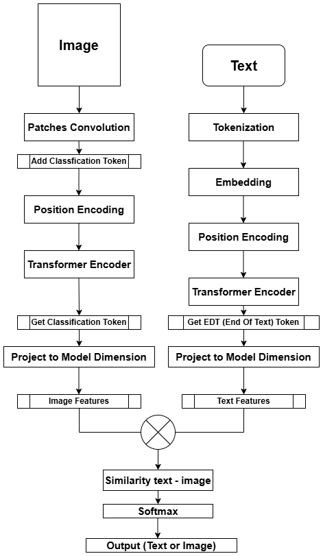

# Image Classification and Text based Image Search
## Overview
### Framework
Traditional computer vision systems are typically constrained by a fixed set of predefined categories, limiting their capacity to generalize to new or unseen objects. CLIP (Contrastive Language – Image Pretraining) represents a paradigm shift by enabling open-world object recognition through learning semantic alignments between textual descriptions and visual content.

Unlike conventional classification approaches, CLIP is trained with a contrastive objective to learn a shared embedding space for both image and text modalities. Specifically, the model is optimized to maximize the cosine similarity between matched image-text pairs while minimizing it for mismatched pairs. As illustrated in the contrastive pre-training stage, this is implemented by computing the dot product between image feature vectors $\{I_1, ..., I_N\}$ and their corresponding text feature vectors $\{T_1, ..., T_N\}$ within each minibatch.

The objective ensures that the embedding vectors of semantically aligned pairs $(I_i, T_i)$ are drawn closer together in the feature space, while unrelated pairs are pushed apart. This training methodology allows CLIP to recognize and reason about novel concepts purely from textual descriptions without requiring task-specific fine-tuning. As a result, CLIP marks a significant step toward more generalized and human-like visual understanding in artificial intelligence systems.
<p align="center">
  
</p>
<p align="center"><em>(Model Architecture)</em></p>

### Approach
This project is an interactive application that leverages a build and custom [CLIP](https://github.com/openai/CLIP) (Contrastive Language–Image Pretraining) model to **classify images** from the CIFAR-10 dataset and **retrieve similar images based on text** descriptions. The model is built and customized using PyTorch to work effectively on the [CIFAR-10](https://huggingface.co/datasets/uoft-cs/cifar10) dataset.

## 🚀 Application Deployment

### System Architecture & Design
Built a **web application** implementing multi-service architecture for CLIP model deployment. The system demonstrates service separation and container orchestration, showcasing both deep learning engineering and software development capabilities.
**Core Architecture Components:**
* **FastAPI Backend Service**: HTTP API server for managing CLIP model classification and searching.
* **Streamlit Frontend Application**: Multi-page interactive web interface with real-time visualization and user interaction.  
* **Nginx Reverse Proxy**: Request routing and unified endpoint management.
* **Docker Container Orchestration**: Multi-container deployment with service networking and isolation.

## Demonstrate
A demonstrate of the application allows users to upload or select an image from CIFAR-10, classify it, and perform text-based image search to find visually similar images based on textual input.
- Click the Video below for full demo.

<p align="center">
  <a href="https://youtu.be/F9J-cTw5CmA" target="_blank">
    
  </a>
</p>
<p align="center"><em>(Video Demo)</em></p>

## Usage
1. Clone the repository:
    ```bash
    git clone https://github.com/dduyds/Image-Classification-and-Text-based-Image-Search.git
    ```
2. Install dependencies:
    ```bash
    cd model_api
    pip install -r requirements.txt
    cd streamlit_ui
    pip install -r requirements.txt
    ```
### Option 1. Run the Python script directly with modes

The main script supports three modes via the `--mode` argument:

- `TRAIN`: Train the model.
- `TEST`: Test the model.
- `INFERENCE`: Perform inference (default).

When using `INFERENCE`, you can specify the index of the image to predict via the `--idx` argument.

Examples:

- Train the model:

  ```bash
  python main.py --mode TRAIN
  ```

- Test the model:

  ```bash
  python main.py --mode TEST
  ```

- Inference on image with index 5:

  ```bash
  python main.py --mode INFERENCE --idx 5
  ```

### Option 2. Run the interactive app with Streamlit
Enable model api
```bash
cd model_api
uvicorn model_api:app --host 0.0.0.0 --port 8000 --reload
```
Start the Streamlit web interface with:
```bash
cd streamlit_ui
streamlit run Home.py
```

Open the browser at the URL provided to interact with the application.
